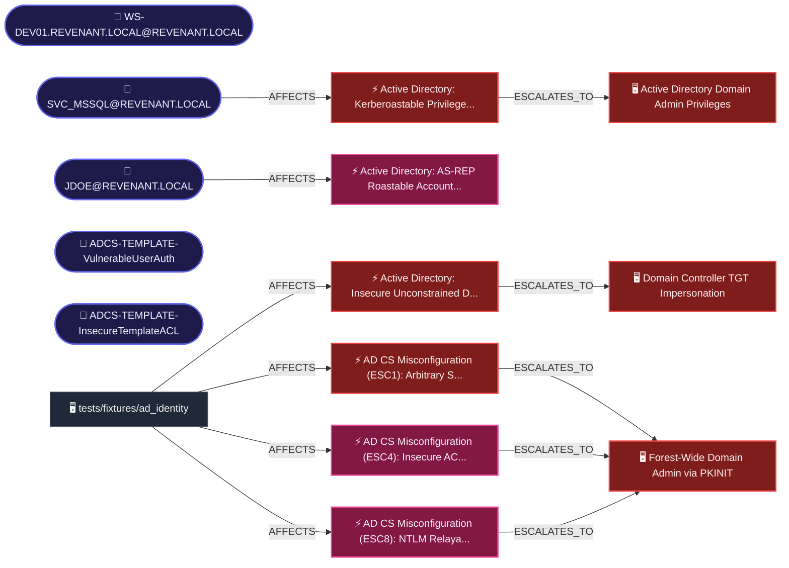

# REVENANT Security Assessment Report

**Target:** `tests/fixtures/ad_identity`  
**Campaign ID:** `801d8af5-dbb9-403f-9d1d-041ecf31814a`  
**Date:** 2026-09-17T12:48:19.178903+00:00  
**Total Discovered Assets:** 5  
**Total Findings:** 6  

---

## Executive Summary

REVENANT completed an automated multi-domain security assessment against `tests/fixtures/ad_identity`.

| Severity | Count |
|:---|:---:|
| 🔴 CRITICAL | 3 |
| 🟠 HIGH | 3 |
| 🟡 MEDIUM | 0 |
| 🔵 LOW | 0 |
| ⚪ INFO | 0 |

---

## Discovered Assets (5)

- **WS-DEV01.REVENANT.LOCAL@REVENANT.LOCAL**
- **SVC_MSSQL@REVENANT.LOCAL**
- **JDOE@REVENANT.LOCAL**
- **ADCS-TEMPLATE-VulnerableUserAuth**
- **ADCS-TEMPLATE-InsecureTemplateACL**

---

## Attack Graph & Exploit Chains

The following directed attack graph illustrates cross-domain relationships synthesized from discovered assets, credentials, and vulnerabilities:



### Strategic Remediation Choke Points
Remediating the following bottleneck nodes breaks multiple intersecting exploit paths:

| Node / Asset | Type | Severity | Paths Affected | Remediation Priority |
|:---|:---:|:---:|:---:|:---:|
| `tests/fixtures/ad_identity` | ASSET | INFO | 6 | **CRITICAL** |
| `Forest-Wide Domain Admin via PKINIT` | OBJECTIVE | CRITICAL | 6 | **CRITICAL** |
| `Active Directory: Kerberoastable Privileged Account (SVC_MSSQL@REVENANT.LOCAL)` | VULNERABILITY | CRITICAL | 3 | **CRITICAL** |
| `Active Directory: Insecure Unconstrained Delegation on Workload (WS-DEV01.REVENANT.LOCAL)` | VULNERABILITY | CRITICAL | 3 | **CRITICAL** |
| `AD CS Misconfiguration (ESC1): Arbitrary SAN Subject with Client Authentication (VulnerableUserAuth)` | VULNERABILITY | CRITICAL | 3 | **CRITICAL** |
| `SVC_MSSQL@REVENANT.LOCAL` | IDENTITY | INFO | 2 | **HIGH** |
| `Active Directory Domain Admin Privileges` | OBJECTIVE | CRITICAL | 2 | **HIGH** |
| `Domain Controller TGT Impersonation` | OBJECTIVE | CRITICAL | 2 | **HIGH** |
| `AD CS Misconfiguration (ESC4): Insecure ACL on Certificate Template (InsecureTemplateACL)` | VULNERABILITY | HIGH | 2 | **HIGH** |
| `AD CS Misconfiguration (ESC8): NTLM Relayable Web Enrollment Endpoint (REVENANT-CA01)` | VULNERABILITY | HIGH | 2 | **HIGH** |

---

## MITRE ATT&CK Enterprise Matrix Coverage

| MITRE Tactic | Technique ID | Technique Name | Findings | Highest Severity |
|:---|:---:|:---|:---:|:---:|
| **Privilege Escalation** (`TA0004`) | `T1558.001` | Steal or Forge Kerberos Tickets: Unconstrained Delegation | 1 | 🔴 CRITICAL |
| **Privilege Escalation** (`TA0004`) | `T1649` | Steal or Forge Authentication Certificates (AD CS) | 3 | 🔴 CRITICAL |
| **Privilege Escalation** (`TA0004`) | `T1078` | Valid Accounts | 1 | 🟠 HIGH |
| **Credential Access** (`TA0006`) | `T1558.003` | Steal or Forge Kerberos Tickets: Kerberoasting | 1 | 🔴 CRITICAL |
| **Credential Access** (`TA0006`) | `T1558.004` | Steal or Forge Kerberos Tickets: AS-REP Roasting | 2 | 🟠 HIGH |
| **Credential Access** (`TA0006`) | `T1187` | Forced Authentication (NTLM Relay) | 1 | 🟠 HIGH |

---

## Detailed Findings

### 1. [CRITICAL] Active Directory: Insecure Unconstrained Delegation on Workload (WS-DEV01.REVENANT.LOCAL) (CWE-269)
- **Target / Endpoint:** `REVENANT.LOCAL/WS-DEV01.REVENANT.LOCAL`
- **Tool:** `bloodhound` | MITRE: T1558.001
- **Description:** Host or service account 'WS-DEV01.REVENANT.LOCAL' is configured with Unconstrained Delegation (TRUSTED_FOR_DELEGATION). Whenever any domain user or administrator authenticates to this host, their Ticket-Granting Ticket (TGT) is stored in memory and can be harvested.
- **Remediation:** Configure Resource-Based Constrained Delegation (RBCD) or Kerberos Constrained Delegation (KCD). Ensure high-privilege administrative accounts are marked 'Account is sensitive and cannot be delegated'.
- **Reproduction:**
  ```bash
  # Inspect Kerberos delegation flags on WS-DEV01.REVENANT.LOCAL:
Get-ADComputer -Identity WS-DEV01.REVENANT.LOCAL -Properties TrustedForDelegation
  ```
- **Evidence:**
  ```text
  Object: WS-DEV01.REVENANT.LOCAL
TrustedForDelegation: True
is_dc: False
  ```

### 2. [CRITICAL] Active Directory: Kerberoastable Privileged Account (SVC_MSSQL@REVENANT.LOCAL) (CWE-521)
- **Target / Endpoint:** `REVENANT.LOCAL/SVC_MSSQL@REVENANT.LOCAL`
- **Tool:** `bloodhound` | MITRE: T1558.003
- **Description:** Account 'SVC_MSSQL@REVENANT.LOCAL' has a registered Service Principal Name (SPN) with administrative domain privileges. Any authenticated domain user can request a Kerberos TGS ticket and attempt offline brute-force cracking of the service hash.
- **Remediation:** Migrate service to a Group Managed Service Account (gMSA) with 128-character auto-rotated passwords, enforce AES-256 encryption, or remove administrative rights from the SPN account.
- **Reproduction:**
  ```bash
  # Request TGS ticket and export hash:
GetUserSPNs.py REVENANT.LOCAL/user:password -request -spn SVC_MSSQL@REVENANT.LOCAL
  ```
- **Evidence:**
  ```text
  Account: SVC_MSSQL@REVENANT.LOCAL
Domain: REVENANT.LOCAL
has_spn: True
admincount: True
  ```

### 3. [CRITICAL] AD CS Misconfiguration (ESC1): Arbitrary SAN Subject with Client Authentication (VulnerableUserAuth) (CWE-295)
- **Target / Endpoint:** `ADCS/VulnerableUserAuth:ESC1`
- **Tool:** `certipy` | MITRE: T1649
- **Description:** Certificate template 'VulnerableUserAuth' permits enrollees to supply an arbitrary Subject Alternative Name (SAN), grants Client Authentication EKU, and requires no Certificate Manager approval. Any authenticated domain user can enroll for a certificate requesting Domain Admin identity and authenticate via Kerberos PKINIT.
- **Remediation:** In Certificate Templates Console, edit template 'VulnerableUserAuth': Under 'Subject Name' tab, select 'Build from this Active Directory information', or under 'Issuance Requirements' tab, check 'CA certificate manager approval'.
- **Reproduction:**
  ```bash
  certipy req -u user@domain -p password -target dc.domain -template VulnerableUserAuth -upn administrator@domain
  ```
- **Evidence:**
  ```text
  Template: VulnerableUserAuth
Enrollee Supplies Subject: True
Extended Key Usage: ['Client Authentication', 'Smart Card Logon']
Requires Manager Approval: False
  ```

### 4. [HIGH] Active Directory: AS-REP Roastable Account (JDOE@REVENANT.LOCAL) (CWE-287)
- **Target / Endpoint:** `REVENANT.LOCAL/JDOE@REVENANT.LOCAL`
- **Tool:** `bloodhound` | MITRE: T1558.004
- **Description:** Account 'JDOE@REVENANT.LOCAL' has Kerberos pre-authentication disabled (DONT_REQ_PREAUTH). Any network attacker can solicit an encrypted AS-REP response from the KDC without supplying credentials and crack the user password offline.
- **Remediation:** Enable Kerberos pre-authentication on account 'JDOE@REVENANT.LOCAL' in Active Directory Users and Computers.
- **Reproduction:**
  ```bash
  # Solicit AS-REP credential hash:
GetNPUsers.py REVENANT.LOCAL/ -usersfile accounts.txt -format hashcat
  ```
- **Evidence:**
  ```text
  Account: JDOE@REVENANT.LOCAL
Domain: REVENANT.LOCAL
dont_req_preauth: True
  ```

### 5. [HIGH] AD CS Misconfiguration (ESC4): Insecure ACL on Certificate Template (InsecureTemplateACL) (CWE-284)
- **Target / Endpoint:** `ADCS/InsecureTemplateACL:ESC4`
- **Tool:** `certipy` | MITRE: T1078, T1649
- **Description:** Certificate template 'InsecureTemplateACL' grants unprivileged domain users write permissions (GenericAll, GenericWrite, or WriteDacl). An unprivileged attacker can modify the template configuration to enable ESC1/ESC2 flags and achieve domain elevation.
- **Remediation:** Remove write and modify permissions for unprivileged groups on certificate template 'InsecureTemplateACL'. Restrict DACL to Domain Admins and Enterprise Admins.
- **Reproduction:**
  ```bash
  # Modify template ACL or properties:
certipy template -u user@domain -p password -target dc.domain -template InsecureTemplateACL -save-old
  ```
- **Evidence:**
  ```text
  Template: InsecureTemplateACL
Insecure Write Rights granted to unprivileged principals.
  ```

### 6. [HIGH] AD CS Misconfiguration (ESC8): NTLM Relayable Web Enrollment Endpoint (REVENANT-CA01) (CWE-287)
- **Target / Endpoint:** `ADCS/REVENANT-CA01:ESC8`
- **Tool:** `certipy` | MITRE: T1187, T1649
- **Description:** Certificate Authority 'REVENANT-CA01' exposes an HTTP Web Enrollment endpoint without Extended Protection for Authentication (EPA). An attacker can coerce machine accounts via MS-RPRN (SpoolSample) or PetitPotam and relay NTLM authentication to enroll domain controller certificates.
- **Remediation:** Enable Extended Protection for Authentication (EPA) and require SSL on the AD CS Web Enrollment IIS virtual directory.
- **Reproduction:**
  ```bash
  # Relay coerced NTLM authentication to AD CS:
ntlmrelayx.py -t http://REVENANT-CA01/certsrv/certfnsh.asp -smb2support --adcs
  ```
- **Evidence:**
  ```text
  CA: REVENANT-CA01
Web Enrollment: Enabled
Extended Protection for Authentication: Disabled
  ```
